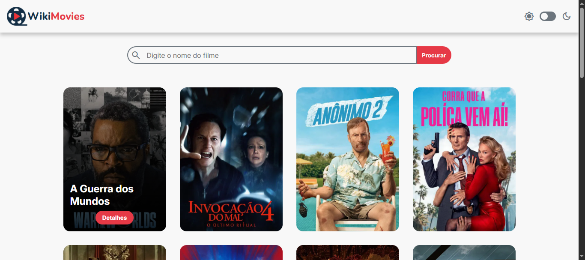
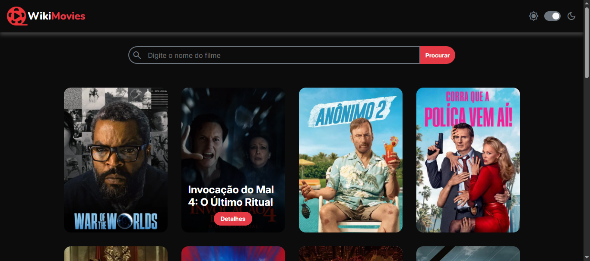

# 🎬 WikiMovies

WikiMovies é uma aplicação web que permite pesquisar filmes através da API do [The Movie Database (TMDB)](https://www.themoviedb.org/).  
Com ele, você pode:
- Buscar filmes pelo nome
- Navegar entre páginas de resultados
- Visualizar detalhes de cada filme (título, idioma, popularidade, data de lançamento, descrição, etc.)
- Alternar entre tema claro e escuro 🌙☀️

---

## 📸 Preview

- Tema claro:


- Tema escuro:


---

## 🚀 Tecnologias utilizadas

- **HTML5** → Estrutura da aplicação  
- **CSS3** → Estilização e tema claro/escuro  
- **JavaScript (ES6+)** → Lógica, consumo da API e manipulação do DOM  
- **Google Fonts (Nunito, Inter)** → Tipografia  
- **Google Material Symbols** → Ícones  
- **TMDB API** → Fonte de dados dos filmes  

---

## 📂 Estrutura de arquivos

```
├── wiki-movies
│ ├── src
│ │ ├── css
│ │ │ └── style.css
│ │ ├── images
│ │ │ ├── favicon.png
│ │ │ ├── logo-dark-theme.png
│ │ │ ├── logo-light-theme.png
│ │ │ ├── previewDark.png
│ │ │ └── previewLight.png
│ │ └── scripts
│ │   └── script.js
│ ├── index.html
│ ├── LICENSE
│ └── README.md
```

---

## ⚙️ Como acessar o projeto

### 🔗 Online
Através do link da página: [WikiMovies Online](https://charlesson-mp.github.io/wiki-movies)

### 💻 Local
1. Clone este repositório:
    ```bash
    git clone https://github.com/seu-usuario/wiki-movies.git
    ```
2. Acesse a pasta do projeto:
    ```bash
    cd wiki-movies
    ```
3. Abra o arquivo index.html no navegador.

---

## 🔑 API Key

Este projeto utiliza a API do TMDB.
Você precisa criar uma conta e gerar sua própria API_KEY em:
👉 https://www.themoviedb.org/settings/api

No arquivo script.js, substitua a constante pelo seu valor:
```
    const API_KEY = 'SUA_API_KEY_AQUI';
```

---

## 📝 Funcionalidades

- Pesquisa de filmes por nome

- Paginação de resultados

- Visualização de detalhes do filme

- Tema claro/escuro

- Feedback visual para erros (campo de pesquisa vazio, filme não encontrado)

---

## 🧑‍💻 Autor

Desenvolvido por Charlesson ✨
Se quiser trocar uma ideia, me chama no [LinkedIn](https://www.linkedin.com/in/charlesson-mendes-developer/)
 ou dá uma estrela ⭐ no repositório!

 ---

## 📜 Licença

Este projeto está sob a licença GNU 3.
Veja o arquivo LICENSE
 para mais detalhes.